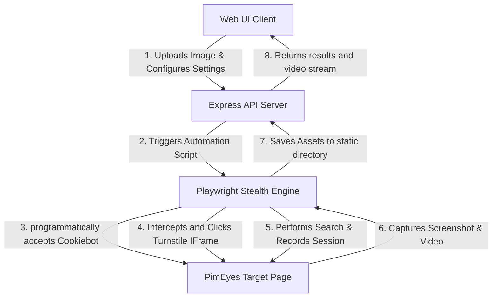

# 🤖 PimEyes AutoPilot: Advanced Search Automation

[](https://nodejs.org/)
[](https://playwright.dev/)
[](https://www.docker.com/)
[](https://railway.app/)

A premium, production-ready reverse image search automation engine designed for **PimEyes**. Built with a sleek dark-glass dashboard, real-time terminal log stream, browser recording playback, and advanced anti-bot evasion.

---

## ⚡ System Architecture



---

## ✨ Features

- **🛡️ Playwright Stealth Integration:** Spoofs user-agents, hides `navigator.webdriver` footprint, mimics real WebGL/Canvas rendering parameters, and randomizes delays to evade Cloudflare's browser fingerprinting.
- **🔄 Dynamic Cookiebot Bypass:** Programmatically wipes blocking overlay dialogs and syncs dynamic state-bindings on Terms & Conditions checkboxes.
- **🎯 Nested IFrame Targeting:** Employs advanced `frameLocator` mechanics to find, wait for, and execute targeted clicks inside the Cloudflare Turnstile "I am human" challenge box.
- **📹 Live WebM Screen Recording:** Automatically captures high-definition screen video of the browser's form submissions, saving it as a `.webm` clip for immediate UI playback.
- **💻 Real-Time Terminal View:** Feeds backend browser logs dynamically into a custom terminal emulator on the dashboard.
- **📊 Interactive Metrics Dashboard:** Displays execution duration, security clearance status, and data-sync statistics upon search completion.
- **📥 Session Log Exporter:** Features a button to package terminal logs into a clean, timestamped `.log` file for immediate local download.
- **⚙️ Developer Headless Toggle:** Includes a switch enabling developers to toggle headless mode off for visual desktop debugging.

---

## 🕵️‍♂️ Reverse Engineering & Network Analysis

Using **HTTP Toolkit** to intercept network calls, the request-response lifecycle was reverse-engineered to identify core automation friction points:

### 1. The Dynamic Consent Wall
* **Analysis:** PimEyes uses a multi-tier consent wall requiring user agreement on terms of service, age confirmation, and facial biometric processing. Standard selectors often fail because the elements dynamically bind to reactive Vue/React components.
* **Solution:** The engine waits for elements to fully render, uses native Playwright actions to force check the dynamic checkbox inputs directly, and bypasses duplicate events that cancel out selections.

### 2. TLS/JA3 Fingerprinting
* **Analysis:** Attempts to execute direct `HTTP POST` requests to `/api/upload` via `axios` or Python `requests` are blocked instantly with a `403 Forbidden` response. Cloudflare analyzes the TLS Client Hello handshake (JA3 fingerprint) and flags non-browser clients.
* **Solution:** We run the search inside a Playwright-controlled browser, allowing Cloudflare to naturally negotiate the handshake and validate TLS signatures while we execute DOM automation.

---

## 📦 Local Installation

### Prerequisites
* **Node.js** (v18 or higher)
* **npm** (v9 or higher)

### Setup Steps
1. Clone the repository and navigate to the project directory:
   ```bash
   git clone https://github.com/msrilaya18/PimEyes.git
   cd PimEyes/prj
   ```

2. Install dependencies:
   ```bash
   npm install
   ```

3. Launch the development server:
   ```bash
   node server.js
   ```

4. Access the web dashboard at:
   👉 **`http://localhost:3000`**

---

## 🐋 Cloud Deployment (Docker & Railway)

This repository includes a multi-stage `Dockerfile` optimized for headless browser runners.

### Deploying to Railway (Recommended):
1. Create a free account at **[railway.app](https://railway.app)** and log in using your GitHub account.
2. Click **New Project** ➡️ **Deploy from GitHub repo** ➡️ Select your **`PimEyes`** repository.
3. Click **Deploy Now**. Railway will automatically locate the `Dockerfile` at the root and build the application.
4. Once deployed, click on the **PimEyes** service box ➡️ **Settings** tab.
5. Under **Networking**, click **Generate Domain** to get a permanent, 24/7 public link.

---

*Architected as a core component of the Automation Engineer Internship Selection Process.*
